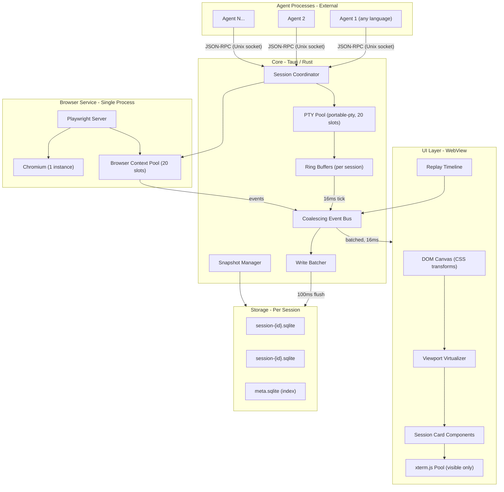

# Agent Canvas: Technical Architecture and Implementation Plan

Target: **20 concurrent agents** with terminals and browsers, addressing all identified bottlenecks.

---

## CRITICAL ARCHITECTURAL RULES

These rules are **non-negotiable**. Every implementation decision MUST respect them. They are repeated throughout this document where relevant.

1. **PTYs MUST live in Rust (portable-pty), NEVER in Node.** No Node child processes for terminal handling. Agents send commands over JSON-RPC; Rust owns the PTY, ring buffer, and coalescing.
2. **ONE Chromium instance, NEVER one per agent.** Use a shared Playwright server with a browser context pool (max 20 contexts). Starting multiple Chromium processes wastes 3–5 GB of RAM.
3. **Per-session SQLite files, NEVER a single shared database.** Each session gets its own `.db` file with its own WAL. Deleting a session = deleting a file. Zero write contention between sessions.
4. **DOM canvas with CSS transforms, NEVER WebGL/PixiJS.** Session nodes contain live xterm.js terminals (DOM elements). Mixing DOM overlays on a WebGL canvas causes layout thrashing. Pure DOM works on both WebKit and WebKitGTK.
5. **Coalesce before sending.** PTY output goes into a 64 KB ring buffer. The coalescing bus drains ALL 20 ring buffers into ONE batched IPC message per frame (16 ms). NEVER send one IPC message per PTY chunk.
6. **Snapshots from day 1, NEVER defer them.** Without snapshots, replay is O(all events). With snapshots every 30 s, replay from any point applies at most ~500 events.
7. **Agents do NOT own heavy resources.** Agents are lightweight orchestrators. They do NOT spawn PTYs. They do NOT launch browsers. They request the Rust core to do these things via JSON-RPC over Unix socket.

> Re-read the 7 rules above before starting ANY stage. Every stage description below re-states the rules relevant to it.

---

## 1. Architecture Overview



### Separation of Concerns

- **UI Layer**: Renders ONLY what is in the viewport. Receives pre-batched event updates from Rust at frame rate. Zero business logic. The UI NEVER reads from SQLite directly — all data comes through the coalescing bus.
- **Core (Rust)**: Owns ALL PTY sessions, ring buffers, event coalescing, write batching, and snapshot scheduling. Single process, multi-threaded via tokio. This is the only process that touches PTYs and storage.
- **Browser Service**: Single Playwright server process managing ONE Chromium instance with a pool of browser contexts. Agents request contexts via the core. NEVER start a second Chromium process.
- **Agent Processes**: External, language-agnostic. Communicate with the core over Unix domain socket using JSON-RPC. Agents do NOT own PTYs or browsers directly — they request the core to execute commands or browser actions on their behalf. An agent that needs a terminal sends `terminal.exec`; an agent that needs a browser sends `browser.new_context`.
- **Storage**: Per-session SQLite files. One meta DB indexes all sessions. No shared write contention. NEVER put multiple sessions in the same database file.

> **Reminder — PTYs live in Rust, not Node.** Agents send "run this command" over JSON-RPC. Rust spawns the PTY, reads output into a ring buffer, and pushes coalesced chunks to both UI and storage. This eliminates 20 Node child processes and the Node single-thread bottleneck.

---

## 2. Technology Choices

### Desktop shell: **Tauri 2.x**

Rust backend is critical: it owns PTY management, ring buffers, write batching, and the coalescing bus. None of this would be feasible in Electron without a native addon. MUST use Tauri 2 (not Tauri 1 — the plugin system and IPC model changed significantly).

### Canvas: **React + DOM-based canvas (CSS transforms)**

Session nodes contain live terminal text (xterm.js), browser status, and controls — all inherently DOM. A pure-DOM canvas avoids WebGL/DOM hybrid layout thrashing and works consistently on WebKit (macOS) and WebKitGTK (Linux).

**How it works:** One container div with `transform: translate(x,y) scale(z)`. Session cards are absolutely-positioned children. Pan/zoom updates ONE CSS transform on ONE element. Same approach as tldraw and Excalidraw.

**DO NOT use PixiJS, WebGL, or Canvas 2D for the main canvas.** DOM handles 50–100 nodes before layout cost matters. 20 nodes is well within budget.

### Agent protocol: **JSON-RPC over Unix domain socket**

Agents are lightweight orchestrators that send commands. They do NOT own PTYs. They do NOT own browsers. Those are centrally managed in Rust.

Agent connects to a Unix domain socket exposed by the Tauri core. JSON-RPC methods:

- Terminal: `terminal.exec`, `terminal.read`, `terminal.write`, `terminal.resize`
- Browser: `browser.new_context`, `browser.navigate`, `browser.click`, `browser.type`, `browser.screenshot`, `browser.close_context`

Agents can be written in any language (Node, Python, Go, shell script). The app does not care.

### Terminal: **portable-pty (Rust crate) + 64 KB ring buffer**

> **IMPORTANT — This is the core performance innovation.** PTY data NEVER leaves the Rust process until it is coalesced.

Data flow:

1. PTY raw output → per-session ring buffer (64 KB, fixed-size, in Rust)
2. Every 16 ms (frame tick) → coalescing bus drains ALL ring buffers → ONE batched IPC message to WebView
3. Every 100 ms (storage tick) → write batcher flushes coalesced events to SQLite

This means: **one IPC call per frame for all 20 sessions, not one per PTY chunk.** A 30-minute session stores ~18 K coalesced events instead of ~900 K raw chunks.

The ring buffer is fixed-size (64 KB). If PTY produces faster than the UI consumes, old data is overwritten. This is correct — users cannot read 300 KB/sec of terminal output. Storage gets the coalesced version which accumulates until flush (no data loss for storage).

### Browser: **Shared Playwright server, ONE Chromium, context pool**

> **IMPORTANT — ONE Chromium instance, not 20.** One Chromium (~~300 MB base) + 20 browser contexts (~~30–50 MB each) = ~1.1 GB total. Twenty separate Chromium instances = ~4–6 GB. Savings: 3–5 GB.

Start Playwright server via `npx playwright run-server`. Rust core connects over CDP WebSocket. Each agent session gets a `BrowserContext` (isolated cookies, storage). Max 20 contexts. Lazy allocation — if an agent doesn't need a browser, it doesn't get one. Typical: 8–12 concurrent contexts.

### Storage: **Per-session SQLite files + meta DB**

> **IMPORTANT — Each session gets its OWN SQLite file.** NEVER a single shared database.

- `~/.config/monkeyland/meta.db` — session index (id, name, created, status, file path)
- `~/.config/monkeyland/sessions/{session-id}.db` — events table + snapshots table

Why per-session files:

- Deleting a session = deleting a file. No VACUUM needed.
- Each file has its own WAL and write lock. Zero contention between 20 concurrent sessions.
- File size stays proportional to session length.

Each session DB is opened on demand and closed when inactive.

### Snapshots: **From day 1**

> **IMPORTANT — Implement snapshots in Stage 2, not later.** Without snapshots, replaying a 30-minute session with 18 K events means reading and applying ALL of them. With snapshots every 30 seconds, replay from any point reads at most ~300 events after the nearest snapshot.

The Snapshot Manager runs in Rust. Triggers: every 30 seconds OR every 500 events (whichever first). Captures:

- Terminal ring buffer contents (last 10,000 chars)
- Browser context URL + last screenshot path
- Agent lifecycle state

Stored in the session's `snapshots` table, indexed by `seq_at`.

### Sandbox: **Direct process, same user (MVP)**

Agents run as the current user. Centralized PTY and browser management gives the core a choke point for future sandboxing.

---

## 3. Data and Event Model

### Canonical event envelope

```json
{
  "id": "ulid",
  "seq": 12345,
  "ts_us": 1709312456789000,
  "type": "terminal_chunk | terminal_block_end | browser_action | browser_snapshot | agent_lifecycle | canvas_layout",
  "payload": { ... }
}
```

Key fields:

- `id` — ULID (sortable, no index needed for ordering)
- `ts_us` — microsecond Unix timestamp (**integer, NOT ISO 8601 string**) for faster comparison and smaller storage
- `session_id` — implicit, because each session has its own DB file. Do NOT add a session_id column.
- `seq` — monotonic counter per session for gap detection

### Event types

**terminal_chunk** — `{ "data": "<raw utf-8>", "bytes": N }`
Coalesced output. One event per 100 ms flush or per command boundary. Average 1–4 KB. This is NOT raw PTY output — it is the coalesced version from the ring buffer.

**terminal_block_end** — `{ "exit_code": 0, "command": "npm install", "duration_ms": 4500 }`
Emitted when a command finishes (shell integration or prompt detection). Enables timeline markers and snapshot triggers.

**browser_action** — `{ "action": "navigate|click|type|wait|evaluate", "target": "selector or url", "value": "...", "duration_ms": N }`
One event per Playwright API call. Low frequency (~2–10/sec per agent).

**browser_snapshot** — `{ "url": "...", "title": "...", "screenshot_path": "relative/path.webp" }`
Captured every 5 seconds or on navigation. Screenshot stored as a **file on disk, NOT in SQLite** — to avoid bloating the event DB. WebP format, ~50 KB per frame at 1280x720.

**agent_lifecycle** — `{ "phase": "started|running|waiting|error|stopped", "detail": "...", "resources": {"pty": true, "browser": true} }`

**canvas_layout** — `{ "session_id": "ulid", "x": 0, "y": 0, "w": 800, "h": 600, "collapsed": false }`
Stored in `meta.db`, NOT in session DBs. Debounced (250 ms after last move/resize).

### Snapshot schema

```json
{
  "seq_at": 12300,
  "ts_us": 1709312450000000,
  "terminal_buffer": "<last 10000 chars of terminal>",
  "browser_url": "https://...",
  "browser_screenshot_path": "snapshots/abc.webp",
  "agent_phase": "running"
}
```

Stored in `snapshots` table, indexed by `seq_at`.

### Replay strategy

- **Live mode**: Coalescing bus pushes batched events to UI at 60 fps. Terminal chunks go to xterm.js `write()`. Browser events update a status line. No DB round-trip for live view.
- **Replay mode**: Load nearest snapshot before target time. Stream events from `seq_at` forward. Support play/pause, 1x/2x/4x speed (paced by `ts_us` deltas), and seek (jump to nearest snapshot).
- **Seek cost**: Max ~500 events to apply after a snapshot (30-second interval, ~15 events/sec average). Seek latency: <50 ms.

> **Reminder — Seek = load snapshot + apply events after it.** NEVER replay from the beginning of a session. ALWAYS seek to the nearest snapshot first.

### Log compaction

- **When**: On session close, or when event count exceeds 100 K.
- **How**: `DELETE FROM events WHERE seq < oldest_retained_snapshot.seq_at`. Keep last 20 snapshots (~10 minutes).
- **Disk reclamation**: `VACUUM` the session DB after compaction (safe — session is closed or idle, no write contention).
- **Opt-out**: "Keep everything" mode skips compaction (user setting).

---

## 4. Performance Budget: 20 Concurrent Agents

> These numbers are design constraints, not aspirations. Implementation MUST stay within these budgets. If a change would exceed a budget, redesign the approach — do not just accept the regression.

### Reference workload

20 AI agents on one codebase. Each has a terminal (builds, tests, linters, git) and optionally a browser (Playwright + MCP devtools). Mix: some actively building (high terminal output), some waiting for LLM (idle), some browsing (moderate events).

### Memory budget: ~2.2 GB total

| Component                                   | Per-unit | Count           | Total       |
| ------------------------------------------- | -------- | --------------- | ----------- |
| Tauri process (Rust core + WebView)         | —        | 1               | ~300 MB     |
| PTY kernel buffers                          | ~4 KB    | 20              | ~80 KB      |
| In-process ring buffers                     | 64 KB    | 20              | ~1.3 MB     |
| Playwright server process                   | —        | 1               | ~80 MB      |
| Chromium instance (base)                    | —        | 1               | ~300 MB     |
| Browser contexts                            | ~40 MB   | 12 (avg active) | ~480 MB     |
| Agent processes (lightweight orchestrators) | ~50 MB   | 20              | ~1,000 MB   |
| xterm.js instances (visible in viewport)    | ~5 MB    | 6 (visible)     | ~30 MB      |
| SQLite connections (open sessions)          | ~2 MB    | 20              | ~40 MB      |
| Event coalescing buffers                    | ~16 KB   | 20              | ~320 KB     |
| **Total**                                   |          |                 | **~2.2 GB** |

Headroom on 16 GB machine: ~13.8 GB for agent workloads. Compare to naive design (20 Node processes + 20 Chromium instances): ~8–10 GB. The architecture above saves 6–8 GB.

### Event throughput budget

| Activity                                | Terminal events/sec      | Browser events/sec | Data rate |
| --------------------------------------- | ------------------------ | ------------------ | --------- |
| Idle (waiting for LLM)                  | 0                        | 0                  | 0         |
| Light (editing, git status)             | 5                        | 0                  | ~2 KB/s   |
| Moderate (npm install, build watching)  | 10 (coalesced)           | 2                  | ~8 KB/s   |
| Heavy (cargo build, verbose test suite) | 20 (coalesced)           | 5                  | ~30 KB/s  |
| Burst (cat large log, scrolling output) | 20 (ring buffer absorbs) | 0                  | ~50 KB/s  |

**20-agent aggregate** (realistic mix: 4 idle, 8 light, 5 moderate, 3 heavy):

| Metric                              | Steady state                           | Peak (all building)   |
| ----------------------------------- | -------------------------------------- | --------------------- |
| Coalesced events/sec                | ~250                                   | ~500                  |
| Raw PTY data into ring buffers      | ~200 KB/s                              | ~2 MB/s               |
| Data rate to storage (coalesced)    | ~150 KB/s                              | ~400 KB/s             |
| Data rate over Tauri IPC (batched)  | ~100 KB/frame x 60 fps = ~6 MB/s       | ~12 MB/s              |
| SQLite inserts/sec (batched, 100ms) | ~25 batch inserts/sec (10 events each) | ~50 batch inserts/sec |

SQLite handles 50 batch inserts/sec trivially (single transaction, WAL mode, per-session files).

**Tauri IPC at 6–12 MB/s is the tightest budget.** Mitigation: the coalescing bus sends one batched message per frame containing ONLY **delta updates** for sessions that changed since last frame. Most frames, only 5–10 of 20 sessions have new data — effective payload drops to ~3–5 MB/s.

### Tauri IPC frame budget (16 ms)

```
Rust side:
  Drain 20 ring buffers:         ~0.1 ms (memcpy)
  Build batched JSON payload:    ~0.3 ms (serialize deltas for ~10 active sessions)
  Send via Tauri event:          ~0.2 ms (postMessage to WebView)
WebView side:
  Parse batched JSON:            ~0.5 ms (~50–100 KB)
  Update xterm.js (6 visible):   ~2.0 ms
  Update browser status (6 vis): ~0.3 ms (DOM text update)
  React reconciliation:          ~1.0 ms (minimal, only changed cards)
Total:                           ~4.4 ms
Remaining budget:                ~11.6 ms (>70% headroom for pan/zoom, interaction)
```

> This leaves >70% of each frame free. If any single operation starts consuming >4 ms, investigate immediately.

### Canvas rendering budget

| Zoom level                    | Visible sessions | Strategy                                                        | Cost        |
| ----------------------------- | ---------------- | --------------------------------------------------------------- | ----------- |
| Close (1–4 nodes fill screen) | 1–4              | Full xterm.js + browser details + controls                      | ~3 ms/frame |
| Medium (8–12 nodes visible)   | 8–12             | xterm.js for focused, status-only for others                    | ~4 ms/frame |
| Far (all 20+ visible)         | 20+              | Miniature cards: title + status badge + activity sparkline only | ~2 ms/frame |

**Viewport virtualization** — MUST implement:

- ONLY session nodes intersecting the viewport are mounted in the DOM. Off-screen nodes MUST be unmounted (not hidden — unmounted).
- xterm.js instances are pooled: max 8 active, recycled as user pans.
- Switching a terminal to a new session = `xterm.reset()` + write last snapshot buffer (~10 K chars, <1 ms).
- DO NOT keep all 20 xterm.js instances alive at once. Max 8.

### CPU budget (steady state, 20 agents)

| Component                                     | CPU % (single core) |
| --------------------------------------------- | ------------------- |
| PTY read loops (tokio, 20 async tasks)        | ~2%                 |
| Ring buffer drain + coalescing (16 ms tick)   | ~1%                 |
| JSON-RPC server (Unix socket, 20 connections) | ~1%                 |
| SQLite write batcher (100 ms tick)            | ~1%                 |
| Snapshot manager (30 s tick)                  | <0.1%               |
| WebView rendering (6 visible terminals)       | ~8–15%              |
| Playwright server (event forwarding)          | ~2%                 |
| **Total app overhead**                        | **~15–22%**         |

Chromium browser instances (pages agents test) consume additional CPU independently (100–400% during page loads). This is not under our control.

### Disk I/O budget

| Metric                                                | Value                 |
| ----------------------------------------------------- | --------------------- |
| Sustained write rate (20 agents, steady)              | ~150 KB/s             |
| Peak write rate (all building)                        | ~400 KB/s             |
| Per-hour storage (steady, before compaction)          | ~540 MB               |
| Per-hour storage (after compaction, 10-min retention) | ~90 MB                |
| Browser screenshots (12 contexts, 1/5 s, ~50 KB each) | ~120 KB/s, ~430 MB/hr |
| Total disk per hour (with screenshots, compacted)     | ~520 MB/hr            |
| Recommended free disk for 8-hour workday              | ~5 GB                 |

### File descriptor budget

| Resource                           | FDs      |
| ---------------------------------- | -------- |
| 20 PTY pairs                       | 40       |
| 20 agent Unix sockets              | 20       |
| 20 SQLite file handles             | 20       |
| 1 Chromium + 20 context WebSockets | ~25      |
| Tauri + WebView internals          | ~50      |
| Misc (logging, temp files)         | ~20      |
| **Total**                          | **~175** |

macOS default soft limit: 256. Linux default: 1024. App MUST set `ulimit -n 1024` on startup (do this in Tauri's Rust init).

---

## 5. Security Model

- **Trust boundary**: Single user. Agent processes are semi-trusted (could be buggy). Centralized PTY/browser architecture gives the core a choke point: agents cannot spawn arbitrary processes — they request the core to run commands.
- **Filesystem**: MVP: no restriction. Future: restrict working directory per session.
- **Network**: MVP: no restriction. Future: refuse `browser.navigate` to non-allowlisted URLs.
- **Process isolation**: Agents run as separate processes with same UID. Unix socket requires local connection only (`SO_PEERCRED` on Linux for verification).
- **Resource limits**: Core enforces max 20 PTY slots and max 20 browser contexts. Excess agents get queued or rejected. This prevents fork bombs and memory exhaustion.

---

## 6. MVP Scope

### In scope

- Tauri 2 app, single window
- DOM-based infinite canvas with CSS transform pan/zoom, 20 session nodes
- PTY pool in Rust (portable-pty): 20 concurrent terminals
- Shared Playwright server: 1 Chromium, up to 20 browser contexts
- JSON-RPC over Unix socket: agent protocol for terminal and browser commands
- Per-session SQLite storage with coalesced events and snapshots
- Batched IPC to WebView (16 ms coalescing) and batched SQLite writes (100 ms flush)
- Viewport virtualization with xterm.js pool (max 8 visible)
- Replay with snapshot-based seek, play/pause, speed control
- Canvas layout persistence in meta.db
- Fully offline

### Out of scope — DO NOT implement these

- Multi-user, cloud, remote agents
- Full video / pixel streaming of browser activity
- Docker / VM sandboxing
- Agent framework (agents are external; we provide the platform)
- Multiple browser engines (Chromium only)
- Canvas minimap (only needed at >50 nodes)
- Rich timeline thumbnails
- Windows support
- WebGL / PixiJS (use DOM canvas — see Rule 4)
- Distributed architecture, message queues
- Per-agent Node processes for PTY (use Rust PTY pool — see Rule 1)
- Per-agent Chromium instances (use context pool — see Rule 2)
- Storing raw PTY output as individual events (use coalesced chunks — see Rule 5)

---

## 7. Development Stages

### Stage 1 — Shell and canvas (2 weeks)

**Goal**: Tauri 2 + React + TypeScript shell with a working infinite canvas.

**Key rules for this stage**:

- DOM canvas with CSS transforms. DO NOT use WebGL or PixiJS.
- One container div with `transform: translate(x,y) scale(z)`. Session cards are absolutely-positioned children.
- Viewport culling: unmount off-screen cards, do not merely hide them.

**Deliverables**:

1. [ ] Tauri 2 project scaffolded with React + TypeScript frontend
2. [ ] DOM-based infinite canvas: pan (mouse drag / trackpad) and zoom (scroll / pinch)
3. [ ] 20 placeholder session cards that can be dragged and resized
4. [ ] Viewport culling — only cards intersecting the viewport are mounted in DOM
5. [ ] Layout state persisted (positions saved, restored on reload)

**Validate**: Smooth 60 fps pan/zoom with 20 DOM nodes on macOS WebKit. No jank.

### Stage 2 — Storage and event pipeline (2 weeks)

**Goal**: Per-session SQLite storage with event schema, write batching, and snapshot infrastructure.

**Key rules for this stage**:

- Per-session SQLite files. NEVER a single shared database. (Rule 3)
- Snapshots MUST be implemented in this stage, not deferred. (Rule 6)
- Write batcher flushes every 100 ms as a single transaction, not per-event.

**Deliverables**:

1. [ ] Per-session SQLite files via `rusqlite` — `~/.config/monkeyland/sessions/{session-id}.db`
2. [ ] Meta DB — `~/.config/monkeyland/meta.db` with session index
3. [ ] Event schema: `events` table with columns for id (ULID), seq, ts_us (integer microseconds), type, payload (JSON)
4. [ ] Write batcher: accumulate events in memory, flush every 100 ms as single transaction
5. [ ] Snapshot table in session DB, indexed by `seq_at`
6. [ ] Snapshot manager: capture every 30 s or 500 events (whichever first)
7. [ ] Coalescing event bus skeleton (in Rust, ready to be wired to PTY in Stage 3)
8. [ ] Log compaction: delete events before oldest retained snapshot on session close

**Validate**: Write 500 events/sec sustained for 10 minutes. Replay from snapshot completes in <100 ms.

### Stage 3 — Terminal (2 weeks)

**Goal**: Rust-native PTY pool with ring buffers, coalesced IPC, and xterm.js rendering.

**Key rules for this stage**:

- PTYs in Rust using portable-pty crate. NEVER in Node. (Rule 1)
- 64 KB ring buffer per session. Fixed-size. Old data overwritten on overflow. (Rule 5)
- Coalescing bus drains ALL ring buffers at 16 ms tick into ONE batched Tauri event. (Rule 5)
- xterm.js pool: max 8 visible instances. DO NOT mount all 20 at once. (Viewport virtualization)
- Agents do NOT spawn PTYs. They send JSON-RPC commands to Rust core. (Rule 7)

**Deliverables**:

1. [ ] PTY pool using `portable-pty` crate — 20 slots
2. [ ] 20 async PTY read tasks on tokio, each writing to its session's 64 KB ring buffer
3. [ ] Coalescing bus: drain all ring buffers every 16 ms, build one batched JSON payload, send via Tauri event
4. [ ] xterm.js pool in frontend: max 8 instances, recycled on viewport pan
5. [ ] JSON-RPC server on Unix domain socket with methods: `terminal.exec`, `terminal.write`, `terminal.resize`
6. [ ] Terminal events stored via write batcher (from Stage 2): `terminal_chunk` and `terminal_block_end`
7. [ ] Wire coalescing bus output to both UI (Tauri event) and storage (write batcher)

**Validate**: 20 concurrent `yes` commands (max throughput stress test) without UI jank. Ring buffer drops old data gracefully. Memory stays within budget (~1.3 MB for 20 ring buffers).

### Stage 4 — Browser (2 weeks)

**Goal**: Shared Playwright server with browser context pool and event capture.

**Key rules for this stage**:

- ONE Chromium instance. NEVER one per agent. (Rule 2)
- Lazy context allocation — only create a context when an agent requests one.
- Screenshots stored as WebP files on disk, NOT in SQLite.

**Deliverables**:

1. [ ] Spawn Playwright server from Rust via `npx playwright run-server`
2. [ ] Connect Rust core to Playwright via CDP WebSocket
3. [ ] Browser context pool: lazy allocation, max 20 contexts
4. [ ] JSON-RPC commands: `browser.new_context`, `browser.navigate`, `browser.click`, `browser.type`, `browser.screenshot`, `browser.close_context`
5. [ ] Periodic screenshot capture: every 5 s per active context, stored as WebP files
6. [ ] Browser events (`browser_action`, `browser_snapshot`) stored via write batcher
7. [ ] Context crash handling: detect crashed context, notify agent, clean up resources

**Validate**: 12 concurrent browser contexts navigating and interacting without crashes. Screenshots stored and retrievable. Memory stays within ~1.1 GB (1 Chromium + 12 contexts).

### Stage 5 — Replay (2 weeks)

**Goal**: Snapshot-based replay with play/pause/seek/speed control.

**Key rules for this stage**:

- Seek = load nearest snapshot + apply events after it. NEVER replay from session start. (Rule 6)
- Max ~500 events to apply after any snapshot seek. If more, snapshot frequency is too low — fix it.

**Deliverables**:

1. [ ] Replay mode per session: load nearest snapshot before target time
2. [ ] Stream events from snapshot's `seq_at` forward, apply to headless xterm.js buffer
3. [ ] Browser event timeline (list of actions and screenshots)
4. [ ] Play/pause controls
5. [ ] Speed control: 1x, 2x, 4x (paced by `ts_us` deltas between events)
6. [ ] Seek: jump to any time by loading nearest snapshot + applying subsequent events
7. [ ] Timeline UI with markers for `terminal_block_end` and `browser_action` events

**Validate**: Seek to any point in a 1-hour, 20 K-event session in <100 ms. Playback at 4x is smooth.

### Stage 6 — Integration and stress test (2 weeks)

**Goal**: Full 20-agent stress test, compaction tuning, polish, and lifecycle UI.

**Deliverables**:

1. [ ] Run 20 real agent scripts (build-and-test loops) concurrently
2. [ ] Profile memory (must be <2.5 GB), CPU (must be <25% app overhead), disk (~520 MB/hr)
3. [ ] Tune ring buffer sizes, coalescing intervals, snapshot frequency based on profiling
4. [ ] Log compaction on session close — verify disk reclamation
5. [ ] Session list sidebar UI
6. [ ] Layout save/restore (canvas positions in meta.db)
7. [ ] Error handling: agent crash, PTY EOF, browser context crash — graceful recovery
8. [ ] Lifecycle events visible in timeline

**Validate**: 20 agents running for 1 hour with no crashes, no memory leaks, no UI jank. All performance budgets from Section 4 met.

---

## 8. Future Evolution

- **Multi-user**: Add `user_id` to meta.db, auth to Unix socket, sync layer (CRDT or server) for canvas layout. Session data syncs by replicating session DB files.
- **Remote agents**: Replace Unix socket with WebSocket. Same JSON-RPC protocol. Core allocates PTY/browser locally or proxies to remote machine.
- **Cloud replay**: Upload session DB files to cloud storage. Stream events via WebSocket. Add media server for screenshot streaming.
- **Observability**: Event log is the source of truth. Export to Parquet, compute metrics, build dashboards as read-only consumers.
- **Scaling beyond 20**: Per-session-file model scales linearly. At 50+: multiple Chromium instances (20 contexts each), OS PTY limits (macOS default 512), Canvas 2D minimap for zoomed-out view.

---

## Quick Reference: Stack

| Layer          | Choice                                         | Key constraint                                        |
| -------------- | ---------------------------------------------- | ----------------------------------------------------- |
| Desktop        | Tauri 2 (Rust)                                 | PTY pool, ring buffers, write batching all in-process |
| Frontend       | React + TypeScript                             | Ecosystem, xterm.js compatibility                     |
| Canvas         | DOM + CSS transforms                           | NO WebGL. Works on WebKitGTK.                         |
| Terminal       | portable-pty (Rust) + 64 KB ring buffers       | NO Node processes. Coalescing in Rust.                |
| Terminal UI    | xterm.js (pooled, max 8 visible)               | Max 8 mounted. Recycle on pan.                        |
| Browser        | Playwright server (shared) + context pool      | ONE Chromium. Max 20 contexts.                        |
| Agent protocol | JSON-RPC over Unix domain socket               | Language-agnostic. Agents own NO heavy resources.     |
| Storage        | Per-session SQLite (rusqlite) + meta.db        | One file per session. NEVER shared DB.                |
| Events         | ULID-keyed, coalesced, batched writes (100 ms) | 250–500 events/sec, <50 batch inserts/sec             |
| IPC            | Tauri event, batched at 16 ms (frame rate)     | ONE call per frame, ~50–100 KB payload                |
| Snapshots      | Every 30 s or 500 events, in session DB        | Replay seek <100 ms from any point                    |
| Compaction     | On session close, delete pre-snapshot events   | ~520 MB/hr for 20 agents                              |

## Quick Reference: Critical Numbers

| What                           | Value              | Where enforced        |
| ------------------------------ | ------------------ | --------------------- |
| Max concurrent agents          | 20                 | Core PTY/context pool |
| Ring buffer size per session   | 64 KB              | Rust core             |
| IPC coalescing interval        | 16 ms (1 frame)    | Coalescing bus        |
| Storage flush interval         | 100 ms             | Write batcher         |
| Snapshot interval              | 30 s or 500 events | Snapshot manager      |
| Max visible xterm.js instances | 8                  | Frontend pool         |
| Max browser contexts           | 20 (lazy alloc)    | Context pool          |
| Total memory budget            | ~2.2 GB            | Architecture-wide     |
| Frame budget used              | ~4.4 ms of 16 ms   | All layers            |
| App CPU overhead               | ~15–22%            | All layers            |
| Seek latency                   | <100 ms            | Snapshot + replay     |
